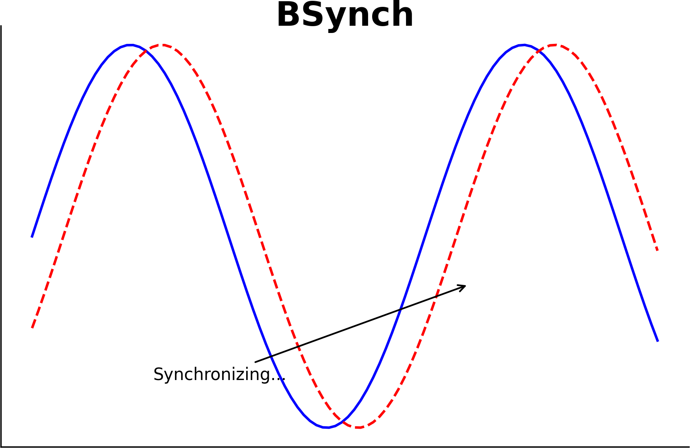

# BSynch



BSynch is an innovative tool designed to provide automatic and continuous synchronization between proxy records. With an intuitive setup and robust architecture, BSynch makes the task of maintaining up-to-date proxy records a breeze.

## Table of Contents

- [Features](#features)
- [Installation](#installation)
- [Usage](#usage)
- [Support & Feedback](#support--feedback)

## Features

- **Continuous Synchronization**: Continuous and objective synchronization between records.
  
- **Performance**: Automatic monitoring of convergence and thinning.

- **Bayesian Approach**: The linking function is inferred using Bayesian Inference, which allows for a robust estimate of the uncertainties of the alignment.
## Installation

1. **Clone the Repository**:

```bash
git clone https://github.com/your-username/BSynch.git
cd BSynch
```


## Usage

1. Add your input and target records to a folder inside the BSynch folder.

2. Run the synchronization process:

```bash
python bsynch.py
```


## Support & Feedback

For any questions, feedback, or concerns, please raise an issue on the GitHub repository, or contact the maintainers directly.

---

Thank you for choosing BSynch for your synchronization needs!


